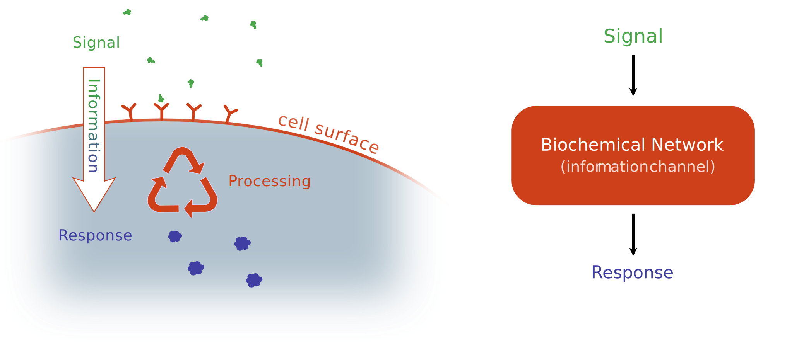

# Information and Noise in Biological Systems

<!-- * noise is inherent in all biological processes, we focus on small ones
    * noise appears on every level of biological systems
    * biological processes often happen out of equilibrium where even macroscopic quantities can exhibit large fluctuations
* _the fundamental source of stochasticity in biology_ is noisy gene expression @2014:Tsimring
    * The central dogma of molecular biology
* there is a strong correspondence between noise and information transmission
    * Shannon's information theory is a _framework_ that allows us to describe noisy transmissions for a very general definition of channel and signal
    * since information theory is so general it is a good candidate for a universal metric to characterize fidelity of biological communication in the presence of noise @2014:Levchenko
    * The study of information transmission is therefore closely related to the study of noise
    * we can split quantities into a pure noise part and a purely deterministic part (Langevin) -> then all uncertainty is contained in the noise part
    * the more noise a readout system (channel) introduces the less information it can transmit about the original signal
    * crucially, in biological systems also the signal is noisy, ergo the noise of the response is the combined effect (not necessarily additively though!)
* mathematically, if we want to describe noise we have to switch from regular ODEs to stochastic differential equations
* we are interested in biochemical signal processing (why?)
    * these are described by the _chemical master equation_ which is an alternative way to write certain stochastic differential equations
    * often there are only small numbers of certain molecules available. This introduces an additional source of noise, the _discretization noise_ (75% of all proteins in _E. Coli._ have a copy number of less than 500 @2014:Tsimring).
    * While often the noise introduced by the intrinsic fluctuations of the signal processing network is often dominant we cannot discard the stochasticity of the signal

* In most cases, chemical master equations cannot be solved analytically and thus require averaging over an ensemble of _stochastic trajectories_
    * In Shannon's information theory the amount of communicated information is not a function of individual signal-response pairs but an averaged quantity that depends on the probability of seeing any random pair
    * these can be generated exactly for example by the direct Gillespie algorithm @1976:Gillespie
    * efficient approximation using for example the $\tau$-leap method @2001:Gillespie -->

_Noise_ is inherent across diverse biological systems and remains relevant at all biological scales. From _stochastic gene expression_ and random _action potential spikes_ in neuronal networks at the cellular scale to the _development of multicellular organisms_ all the way to the _variations in population level_ of competing species in whole ecosystems, we find examples of processes which can only be described precisely by taking into account noise as an intrinsic feature [@2002:Elowitz;@2008:Faisal;1990:PARSONS;2011:Hallatschek;@2014:Tsimring]. In this thesis we focus on the smaller end of this scale, namely on the stochastic description of _biochemical networks_. These comprise among others _gene expression_, _gene regulatory networks_, and _cell signalling_ networks, all of which exhibit noise due to small copy numbers of participating components. Additionally, since biological processes often happen out of equilibrium even macroscopic quantities can exhibit large fluctuations. The main source of noise at the cellular level may be fluctuations in _gene expression_ which propagate to higher levels of biological organization @2014:Tsimring. The abundance of noise in all these systems invites the questions of how cells can reliably make correct decisions, even in complex and changing environments and how cells are able to _encode_ the information about their environment using biochemical networks.

To successfully function, cells must generally correctly react to environmental changes. This requires processing the environmental cues they receive through their receptors and thereby filtering out the useful information from the noisy signal. It is thus tempting to think that optimization of information processing drives the evolution of cellular signaling networks. To understand information processing from the cell's point of view we employ the very general framework of _Information Theory_ which was originally developed to address problems in telecommunications @1948:Shannon. Information theory has been successfully used in biology to study cellular communication, embryonic development and other biological systems @2009:Tkačik [citation needed]. Notably, there are many parallels between biological signal processing and _noisy channels_ which are used for example to describe information transmission across a telephone line.

A crucial feature of _Information Theory_ is that its results are broadly applicable, irrespective of the nature of the communication channel or the medium used to transmit a signal. The communication channel merely describes any kind of abstract device that processes an _input_ in a probabilistic way to yield a corresponding _output_. It turns out that the study of information transmission through such a channel is closely related to the study of noise since the amount of noise introduced by a communication channel sets an upper bound to the amount of data that can be transmitted through it, known as the _channel capacity_ @2006:Cover. Consequently, the output can be described as a deterministic, lossless transformation of the input _plus_ some random noise from the channel which leads to a loss of information. Note that in biological systems the signal itself is typically a fluctuating quantity such that the noise in the output is a combination of the channel noise and the signal noise. Since in cell signalling both, input and output are time-varying quantities we require a description of our system that allows for deterministic _and_ stochastic time evolution.

_Differential equations_ are generally extremely useful to describe any kind of system that evolves deterministically. Therefore it is natural to try to extend the framework of _ordinary differential equations_ (ODEs) to also include the ability to describe the effects of noise. Historically, this approach to modeling stochastic dynamics has first been formulated heuristically by Langevin to describe _Brownian motion_ @1908:Langevin. Later the theory of _stochastic differential equations_ (SDEs) was put on solid mathematical footing by Itô and Stratonovich through the development of _stochastic calculus_ which has been successfully used for applications in physics, biology, economics and others [@2010:Kunita;@1997:Bunkin] [citation needed]. The solutions to SDEs are not ordinary functions like for ODEs but _stochastic processes_ that describe the probabilities for the system to be in any state for every instant in time. Consequently, a stochastic process contains the probabilities for any possible individual sequence of states in time, i.e. the probabilities for individual _trajectories_. Since SDEs contain a complete account of noise in the system, information theoretic concepts like the _entropy_ and the _mutual information_---which we are going to use to understand information transmission in cell signalling---can be applied to stochastic processes. While SDEs can be formulated to describe the evolution of biochemical networks in a discrete state space it is generally more useful to use a less general but simpler _chemical master equation_ for these kinds of problems @2009:Gardiner. 

The chemical master equation is a description of a subset of stochastic processes by deriving the _time-evolution_ of the probability distribution over the discrete state space. I.e. instead of describing the stochastic change to an individual state at a given time it focuses on the _deterministic_ evolution of the whole probability distribution over all states. Conveniently, for a given set of chemical reactions that form a reaction network, we can easily find the corresponding chemical master equation that describes the stochastic dynamics of this network given some assumptions of homogeneity. The stochastic process that emerges of this formulation describes the probabilities for the individual counts of all species and how these probabilities change with time. The ease with which the chemical master equation allows the construction of a stochastic process for any kind of biochemical netork makes it very attractive to try to use _master equations_ as the basis for information theoretic computations. If we can _solve_ the master equation we in principle have access to all stochastic (and therefore information theoretic) properties of the corresponding biochemical network. E.g. in @2010:Tostevin it is shown how by analytically solving some very simple biochemical networks (using some approximations) it is possible to compute the _mutual information_ between time-varying signals and corresponding responses of these networks.

In most cases however, chemical master equations cannot be solved analytically and thus require averaging over an ensemble of _stochastic trajectories_. For instance, in Shannon's information theory the amount of communicated information is not a function of individual signal-response pairs but an averaged quantity that depends on the probability of seeing _any_ random signal-response-pair. Hence the time-efficient generation of stochastic realizations for a given master equation is a central requirement for the exact computation of information processing in chemical networks. A very well known algorithm for the _exact_ generation of trajectories from a given initial condition is the _stochastic simulation algorithm_ (SSA) also known by the name of it's inventor as the _Gillespie algorithm_ @1976:Gillespie. The most widely used variant is the _direct Gillespie method_ which works by alternatingly a) computing the time during which no reactions happen and b) choosing which of the available reactions to perform next. As a result we generate a list of times where some reaction happens and a corresponding list of reactions that specifies the exact trajectory that was generated. This algorithm works quite well in practice and is also used for the work presented in this thesis. It is still worth mentioning that for systems that evolve at many different time scales simultaneously, the direct Gillespie method can be computationally inefficient since by its design it always operates at the smallest time scale. Therefore there have been developed further trajectory-generation algorithms that can generate _approximately_ correct trajectories by accumulating various reactions into a single time step such as the $\tau$-leap method @2001:Gillespie.

## Mutual Information as an Efficiency Measure in Cell Signalling

{#fig:information_cartoon}

* Introduce signals and responses

* For any given signal there are many stochastically possible responses. Conversely, for any given response there is a range of signals that could have produced it. 
* We introduce the notation $X$ for responses and $S$ for signals
* The average uncertainty of responses for a given signal is decribed by the Kullback-Leibler divergence (relative information) $K(X|S)$

* It is necessary to look at time-dependencies of both signals and responses for various reasons
    1. Cells can store information in the time dependency of the responses (e.g. spike intervals) (This is studied extensively in @2019:Cepeda-Humerez for the case were the signal can be regarded as slowly changing)
    2. Crucial information about the signal is not (only) encoded in its momentaneous value but in how it changes in time
* A general algorithm for the computation of the mutual information between time-varying signals and responses is novel

* It is tempting to think that optimization of information processing drives the evolution of cellular signaling networks

* Often information transmission is bound by the noise. Therefore to increase information it is necessary to decrease noise (e.g. by using higher copy numbers). However this usually comes at a metabolic cost such that a balance between energy and noise must be found.

A trajectory $X$ with $N$ steps is defined by a set of pairs $X=\{(t_i, \mathbf{x}_i)\; |\; i=0\ldots N-1 \}$ where $\mathbf{x}_i$ defines the trajectory value at time $t_i$. We can also have random variables over trajectories and therefore probability distributions over the space of all trajectories.

As a next step we can make sense of the entropy of a trajectory. Let $\mathcal{X}_N$ be a random variable over trajectories of length $N$. We call

$$
\mathrm H(\mathcal{X}_N) = - \int\limits_{X\in \sigma(\mathcal{X}_N)} dX\; \mathrm{P}(\mathcal{X}_N = X)\; \ln \mathrm{P} (\mathcal{X}_N = X)
$$ {#eq:entropy_integral}

the entropy of $\mathcal{X}_N$ where $\mathrm{P}(\mathcal{X}_N = X)$ is the probability density function of a trajectory $X=\{(t_i, \mathbf{x}_i)\; |\; i=0\ldots N-1 \}$. We can also define the conditional entropy for trajectories

$$
\mathrm H(\mathcal{X}_N | \mathcal{S}_M) = -\int\limits_{S\in \sigma(\mathcal{S}_N)} dS\; \mathrm{P} (\mathcal{S}_N = S) \int\limits_{X\in \sigma(\mathcal{X}_N)} dX\; \mathrm{P}(\mathcal{X}_N = X | \mathcal{S}_N = S)\; \ln \mathrm{P} (\mathcal{X}_N = X | \mathcal{S}_N = S) \,.
$$

With these two quantities we can express the _mutual information_ between trajectories

$$
\mathrm{I}(\mathcal{X}_N; \mathcal{S}_M) = \mathrm H(\mathcal{X}_N) - \mathrm H(\mathcal{X}_N | \mathcal{S}_M) \,.
$$

The mutual information between two random variables quantifies by how much our certainty of the value of one variable increases if we know the other one.

To shorten the notation we write $\mathrm{P} (\mathcal{X}_N = X)$ as $\mathrm P_{\mathcal{X}_N}(X)$ and if the random variable is clear from the context we even drop the index and only write $\mathrm P(X)$. With the short notation we can rewrite the mutual information

$$
\mathrm{I}(\mathcal{X}_N; \mathcal{S}_M) = \int\limits_{S\in \sigma(\mathcal{S}_N)} dS \int\limits_{X\in \sigma(\mathcal{X}_N)} dX\; \mathrm{P}( X , S)\; \ln \frac{\mathrm{P} ( X |  S)}{\mathrm P(X)} \,.
$$

To evaluate $\mathrm P(X)$ we have to expand it as follows

$$
\mathrm P(X) = \int\limits_{S\in \sigma(\mathcal{S}_N)} dS\; \mathrm P(X, S) = \int\limits_{S\in \sigma(\mathcal{S}_N)} dS\; \mathrm P(X|S) \ \mathrm P (S) \equiv \left\langle P(X | S) \right\rangle_{\mathcal{S}_N} \,.
$$

These relations let us state the mutual information as nested averages over the likelihood $P(X|S)$:

$$
\mathrm{I}(\mathcal{X}; \mathcal{S}) = \left\langle \ln \frac{\mathrm{P} ( X |  S)}{\mathrm P(X)} \right\rangle_{\mathcal{X},\mathcal{S}} = \left\langle \ln \frac{\mathrm{P} ( X |  S)}{\left\langle\mathrm P(X | S) \right\rangle_\mathcal{S}} \right\rangle_{\mathcal{X},\mathcal{S}} \,.
$$

These averages are defined as integrals over the very high-dimensional space of trajectories and thus very hard to evaluate analytically or numerically in the general case. Our goal is use *Monte-Carlo sampling* in the trajectory space to evaluate the above averages. To do this we have to sample trajectories from their probably distribution and we need to evaluate the likelihood for a response given a signal.

## Monte-Carlo simulation

While so-called Monte-Carlo methods comprise a wide variety of approaches to stochastically evaluate integrals or sums the common idea is easily stated. We have a state space $U$ and a probability distribution $p_U$ over that state space. The problem is to evaluate

$$
\langle f(u) \rangle \equiv \int\limits_{u \in U} \mathrm du\; f(u) p_U(u)
$$

where $f: U\rightarrow\mathbb R$ is some smooth function. If $U$ is high-dimensional it is very time-consuming to estimate it by direct numerical integration.

## Estimating the likelihood

The Probability density of a markovian trajectory can be expressed as

$$
\mathrm P(X) = \mathrm P(x_0,t_0;x_1,t_1;\ldots;x_{N-1},t_{N-1}) = \mathrm P(x_0,t_0 ) \prod\limits^{N-1}_{n=1} \mathrm P(x_n,t_n|x_{n-1},t_{n-1}) \,.
$$

Therefore the problem of calculating the likelihood for a particular trajectory amounts to solving two independent problems:

1. estimating the probability density of the starting point $\mathrm P (x_0, t_0)$ of a response
2. calculating the transition probabilities $\mathrm P(x_n,t_n|x_{n-1},t_{n-1})$

For a given chemical reaction network we can write down the chemical master equation. The chemical master equation contains all the information needed to compute the individual terms $\mathrm P(x_n,t_n|x_{n-1},t_{n-1})$ for the entire system.

To calculate the mutual information between $\mathcal{S}$ and $\mathcal X$ we have to consider the entire reaction network containing the components both in $S$ and in $X$. The precise reaction dynamics of the response part of the chemical network crucially depend on the observed signal trajectory. Therefore the chemical master equation for the whole reaction network allows us to compute the likelihood of a response trajectory for a particular signal trajectory:

$$
\mathrm P(\mathcal X = X|\mathcal S = S) = \mathrm P(x_0,t_0;x_1,t_1;\ldots;x_{N-1},t_{N-1} | S) = \mathrm P(x_0,t_0 | S) \prod\limits^{N-1}_{n=1} \mathrm P(x_n,t_n|x_{n-1},t_{n-1}, S) \,.
$$

For increasingly long trajectories this quantity will in many physically relevant cases either grow or decay exponentially (*TODO: explain why*). Thus sufficiently long trajectories, the numerical values of the likelihood will not be directly representable by conventional floating-point numbers.

This problem can be avoided if we compute the *log-likelihood* $\ell(X|S) \equiv \ln\mathrm P(X|S)$ instead. We can easily rephrase the equation for the likelihood:

$$
\ell(X|S) = \ln\left[ \mathrm P(x_0,t_0 | S) \prod\limits^{N-1}_{n=1} \mathrm P(x_n,t_n|x_{n-1},t_{n-1}, S) \right] = \ln \mathrm P(x_0,t_0 | S) +\sum\limits^{N-1}_{n=1} \ln \mathrm P(x_n,t_n|x_{n-1},t_{n-1}, S)\,.
$$

### The probability density for the starting point of a trajectory

We first look at the term $P_0 = \mathrm P(x_0,t_0 | S)$. Since $S$ is a trajectory in time we can directly conclude from causality that

$$
\mathrm P(x_0, t_0 | S) = \mathrm P(x_0, t_0 | S_{t \leq t_0})
$$

where $S_{t \leq t_0}$ is the temporal piece of the signal up to $t_0$. We further suppose that the signal itself is markovian and therefore has no memory of its past. With this simplification we get

$$
\mathrm P(x_0, t_0 | S) = \mathrm P(x_0, t_0 | S_{t = t_0}) = \frac{\mathrm P((x_0, t_0), (s_0, t_0))}{\mathrm P(s_0, t_0)} \,.
$$

We estimate $P_0$ using gaussian kernel density estimation to approximate both, the joint distribution of $X_0, S_0$ and the marginal distribution of $S_0$.

Knowing the probabilities of the initial condition of both response and signal we can directly estimate the mutual information of $\mathcal{X}_{t=t_0}$ and $\mathcal{S}_{t=t_0}$:

$$
\mathrm I(\mathcal{X}_{t=t_0}, \mathcal{S}_{t=t_0}) = \int ds_0\int dx_0\; \mathrm{P}(x_0, s_0)\; \ln \frac{\mathrm{P} (x_0, s_0)}{\mathrm{P} (x_0) \mathrm{P} (s_0)}
$$

### The transition probabilities

**TODO:** describe how the transition rates follow from the master equation (probably follow the style of Cepeda-Humerez, et. al.)

### Estimating the marginal probability of response trajectories

To calculate the mutual information between trajectories we need to have a good estimate for $\ln\left\langle \mathrm P(X | S) \right\rangle_\mathcal{S}$. We calculate this average by sampling of trajectories $(S^{(i)})_{i=1\ldots N_S}$ from the probability distribution of $\mathcal{S}$:

$$
\ln\left\langle\mathrm P(X | S) \right\rangle_\mathcal{S} \approx \ln \frac{\sum^{N_S}_{i=1} \mathrm P(X|S^{(i)})}{N_S} = \ln \sum^{N_S}_{i=1} \mathrm P(X|S^{(i)}) - \ln N_S
$$

Thus we find that it is enough to be able to compute the likelihood between trajectories to estimate the marginal distribution of trajectories.

In practice (due to limited precision of floating-point arithmetic) it is only possible to evaluate the log-likelihood $\ell(X|S) \equiv \ln\mathrm P(X|S)$. This means that the calculation of the averaged likelihood involves the quantity

$$
\ln \sum^{N_S}_{i=1} \mathrm P(X|S^{(i)}) = \ln \sum\limits^{N_S}_{i=1} \exp \ell(X|S^{(i)}) \equiv \mathrm{LSE}\left( \ell(X|S^{(1)}),\ldots, \ell(X|S^{(N_S)})\right)
$$

where $\mathrm{LSE} : \mathbb{R}^n \rightarrow \mathbb{R}$ is called log-sum-exp \cite{blanchard-2019}. An interesting property of $\mathrm{LSE}$ is that it's a smooth approximation to the $\max$ function. This means that for finite sample sizes the monte-carlo estimate of the averaged likelihood will always be too small!

We approximate the mutual information between trajectories as

$$
\mathrm{I}(\mathcal{X}; \mathcal{S}) = \left\langle \ln \frac{\mathrm{P} ( X |  S)}{\left\langle\mathrm P(X | S) \right\rangle_\mathcal{S}} \right\rangle_{\mathcal{X},\mathcal{S}} = \left\langle \ell ( X |  S) - \mathrm{LSE}\left( \ell(X|S^{(1)}),\ldots, \ell(X|S^{(N_S)})\right) + \ln N_S\right\rangle_{\mathcal{X},\mathcal{S}}
$$

which means that for finite amount of signal samples we will _systematically over-estimate_ the mutual information. **TODO: Is that really true? What about $\ln N_S$?** Even worse: the longer the trajectories the bigger the error becomes since the dimensionality of the space of possible signals is growing.

Another way to phrase this insight is that to get a good approximation for the logarithmic average likelihood, our set of signals that we use for monte-carlo sampling should contain many signals that produce a high likelihood. **Therefore it probably is necessary to come up with a scheme to specifically sample signal trajectories for which the likelihood of a particular trajectory is high**. On the other hand the results do not seem to get significantly better when averaging over more trajectories.

## Chemical Master Equation

As a model for the biochemical processing that takes place inside a cell we suppose that all interactions can be described by a chemical networks composed of different molecular species and reactions between them. Such networks can be described by a _chemical master equation_ which makes it possible to compute all the probabilities associated with the time-evolution of such a system.

For illustrative purposes, let's consider a highly simplified model of gene expression consisting of two components and four reactions 

$$ \begin{gathered}
\emptyset \xrightarrow{\kappa} S \xrightarrow{\lambda} \emptyset\\
S \xrightarrow{\rho} S + X\\
X \xrightarrow{\mu}\emptyset
\end{gathered} $$

The constants $\kappa, \lambda, \rho, \mu$ determine the rates at which the individual reactions occur. For example, assuming a well stirred system in thermal equilibrium, it can be shown that the probabilities for the individual reactions happening at least once in the time interval $[t, t+\mathrm\delta t]$ are

$$
\begin{aligned}
p^{(\kappa)}_{[t, t+\mathrm\delta t]} &= \kappa\delta t + \mathcal{O}(\delta t^2)\\
p^{(\lambda)}_{[t, t+\mathrm\delta t]}(s) &= s\lambda\delta t + \mathcal{O}(\delta t^2)\\
p^{(\rho)}_{[t, t+\mathrm\delta t]}(s) &= s\rho\delta t + \mathcal{O}(\delta t^2)\\
p^{(\mu)}_{[t, t+\mathrm\delta t]}(x) &= x\mu\delta t + \mathcal{O}(\delta t^2)
\end{aligned}
$$ {#eq:transition_probabilities}

where $s$ and $x$ denote the particle numbers of the respective species at time $t$. Consequently, the probability for _any_ of the reactions to occur at least once in the time interval $[t, t+\mathrm\delta t]$ is

$$p_{[t, t+\mathrm\delta t]}(s, x) = (\kappa + s\lambda + s\rho + x\mu)\ \mathrm \delta t + \mathcal{O}(\delta t^2)$$ {#eq:exit_probability}

Using these expressions we can write down the so-called _chemical master equation_ for this network. Let $\mathrm P_{s,x}(t)$ be the probability that the system is in state $(s, x)$ at time $t$. Assuming that at most one reaction happens in the small time interval $[t, t+\delta t]$ we can use the transition probabilities from [@eq:transition_probabilities;@eq:exit_probability] to write

$$
\begin{aligned}
\mathrm P_{s,x}(t + \delta t) =& \phantom{+}p^{(\kappa)}_{[t, t+\mathrm\delta t]}\ \mathrm P_{s-1,x}(t)\\ &+
p^{(\lambda)}_{[t, t+\mathrm\delta t]}(s + 1)\ \mathrm P_{s+1,x}(t)\\ &+
p^{(\rho)}_{[t, t+\mathrm\delta t]}(s)\ \mathrm P_{s,x-1}(t)\\ &+
p^{(\mu)}_{[t, t+\mathrm\delta t]}(x + 1)\ \mathrm P_{s, x + 1}(t)\\ &+ 
\left[1 - p_{[t, t+\mathrm\delta t]}(s, x)\right]\ \mathrm P_{s,x}(t)
\end{aligned}
$$

and by taking the limit $\delta t\rightarrow 0$ we arrive at the chemical master equation

$$
\begin{aligned}
\frac{\partial \mathrm P_{s,x}(t)}{\partial t} &= \lim\limits_{\delta t\rightarrow 0} \frac{\mathrm P_{s,x}(t + \delta t) -  \mathrm P_{s,x}(t)}{\delta t}\\
&= \kappa\ \mathrm P_{s-1,x}(t) +
(s+1)\lambda\ \mathrm P_{s+1,x}(t) +
s\rho\ \mathrm P_{s,x-1}(t) +
(x+1)\mu\ \mathrm P_{s, x + 1}(t)\\ &\phantom{=} - 
(\kappa + s\lambda + s\rho + x\mu)\ \mathrm P_{s,x}(t)
\end{aligned}
$$ {#eq:chemical_master_equation}

In an analogous way a chemical master equation can be derived for any biochemical network [@2009:Gardiner] and thus forms the basis for our further computations. @Eq:chemical_master_equation describes a special kind of _stochastic process_, a so-called _jump process_.

In our example we might interpret $S$ as some signal whose quantity varies stochastically. For every signal molecule there is a constant probability to be sensed by the cell which triggers the creation of an $X$. Additionally, $X$ molecules decays by themselves over time. We call the trajectory of $S$ the "signal" and the trajectory of $X$ the "response". This nomenclature will we used throughout the thesis.

## Jump Processes

Since particle counts can't ever become negative, @eq:chemical_master_equation describes a Markov process in continuous time with the state space $\{(s, x) | s\in\mathbb{N}_0, x\in\mathbb{N}_0\}$. In general, every continuous-time Markov process with a discrete state space obeys a master equation. Such processes are also commonly called _jump processes_ since they generate discontinuous sample paths [@2017:Weber].

A jump process $\mathcal{X}$ with state space $\mathcal{U}$ and an initial state $\mathbf{x}_0\in\mathcal{U}$ at time $t_0$ generates trajectories that can be described by a sequence of pairs $(\mathbf{x}_i, t_i)_{i=1,2,\ldots}$ where at every _transition time_ $t_i$ there occurs a jump in state space $\mathbf{x}_{i-1}\rightarrow \mathbf{x}_{i}$. The trajectories generated by a jump process are infinitely long and we denote the set of all possible trajectories by $\mathcal K(\mathcal X)$. For a given duration $\tau>0$ we denote the set of all unique trajectory segments of duration $\tau$ by $\mathcal K_\tau[\mathcal X]$. Using the master equation for this process we can express the probability density for any trajectory segment in $\mathcal K_\tau[\mathcal X]$.

 The master equation for the process allows to express the probability distribution in trajectory space...

## Simulating a Biochemical Network Driven by an External Signal

When we want to compute information transmission in a biological context it is often

## References

