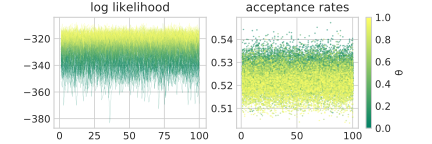

---
author:
  - Manuel Reinhardt
  - Pieter Rein ten Wolde
title: Estimation Strategies Inspired by Statistical Physics
institute: AMOLF
bibliography: ["library.bib"]
link-citations: true
linkReferences: true
autoEqnLabels: true
cref: true
---

# Borrowing Terminology from Statistical Physics

In the context of Bayesian Inference the terms of Bayes' formula
$$
\mathrm P(\mathbf s | \mathbf x) = \frac{\mathrm P(\mathbf x|\mathbf s)\ \mathrm P(\mathbf s)}{\mathrm P(\mathbf x)}
$$ {#eq:bayes_thm}
are typically considered as $\mathrm P(\mathbf s)$ being the _prior_ probability of...

In the framework employed by statistical physics, Bayes' theorem corresponds to the canonical ensemble distribution of $\mathbf s$ (for $\beta=1$)
$$
\mathrm P(\mathbf s | \mathbf x) = \frac{1}{Z(\mathbf x)}\exp\left[-E(\mathbf s, \mathbf x)\right]
$$
where the _partition function_ is defined by $Z(\mathbf x) = \int \mathrm d\mathbf s\ \exp\left[-E(\mathbf s, \mathbf x)\right]$ and $E(\mathbf s, \mathbf x)$ denotes the total energy of the system at state $\mathbf s$. In this context $\mathbf x$ is considered a parameter vector for the specific model used to compute the energy. In classical problems of statistical physics (such as e.g. the _Ising model_) the state space spans the single particle states $\mathbf{s} = (\sigma_1,\ldots,\sigma_n)\in\Omega^n$ for all particles and the energy is given by the _Hamiltonian_ $\mathcal H(\sigma_1,\ldots,\sigma_n;\mathbf x)$ where $\mathbf x$ could contain parameters describing e.g. the interaction strength between neighbouring spins. In our case however we define our energy function by comparison with @eq:bayes_thm as
$$E(\mathbf s, \mathbf x) = -\ln\mathrm P(\mathbf x|\mathbf s)-\ln\mathrm P(\mathbf s)\,.$$ 
From this point of view the marginal density $\mathrm P(\mathbf x) = Z(\mathbf x)$ _is_ the partition function of the canonical ensemble. In statistical physics the partition function is of central importance since its partial derivatives include all thermodynamic properties of a physical system. The free energy of the canonical ensemble is defined by $F(\mathbf x) = -\ln Z(\mathbf x)$ (for $\beta=1$) such that using this terminology we can write the marginal entropy $\mathrm H(\mathcal X)$ as an average over the _"free energies of response trajectories"_
$$
\mathrm H(\mathcal X) = \int\mathrm d\mathbf x\ \mathrm P(\mathbf x)\ F(\mathbf x) = \left\langle F(\mathbf x) \right\rangle_{\mathrm P(\mathbf x)}\,.
$$

Since the computation of the partition function is central to the solution of many statistical problems there has been done considerable work on efficient estimation of the partition function, the free energy and other related quantities such as the _density of states_.

# Thermodynamic Integration

One well-established technique to estimate free energy (differences) is by thermodynamic integration (TI) @1998:Gelman. It allows the accurate computation of the ratio between the normalization constants of two different probability distributions using a continuous path in _distribution space_ that connects both. Since this strategy uses random samples taken from many different distributions along this path it is especially robust when the two distributions have very little overlap. For the computation of the marginal density $\mathrm P(\mathbf x)$ we can (for a given $\mathbf x$) define a suitable path in distribution space between $\mathrm P(\mathbf s)$ and $\mathrm P(\mathbf s, \mathbf x)$. The normalization constants of these distributions are $z_0 = 1$ and $z_1 = \mathrm P(\mathbf x)$, respectively such that the ratio $r=z_1/z_0$ of these normalization constants directly corresponds to the marginal density. Using TI we estimate this ratio using approximately independent samples from a _Markov chain Monte Carlo_ (MCMC) simulation.

In the following sections we will give a quick summary of TI followed by an explanation of the Markov chain Monte Carlo simulation and a discussion of the resulting accuracy of the estimates.

## Summary of TI

Let $q_0$ and $q_1$ be the unnormalized distribution functions and $z_0, z_1$ the corrsponding normalization constants such that $z_i=\int\mathrm d\mathbf s\ q_i(\mathbf s)$. Next we construct a path between $q_0$ and $q_1$, parametrized by $\theta\in[0,1]$ such that $q_\theta$ smoothly connects the end points. We similarly define $z(\theta)$ as the normalization constant of $q_\theta$. A smooth path that can be constructed for any pair of distributions $(q_0, q_1)$ is the _geometric path_ given by $q_\theta=q^{1-\theta}_0\ q^\theta_1$. Note however that variance of the estimate depends on the chosen path and that the geometric path is not the optimal path in general. 

For the estimation of free energy differences we are interested in the ratio $r=z(1)/z(0)$. To find an estimate we differentiate the logarithm of $z(\theta)$ with respect to $\theta$ to arrive at
$$
\frac{\mathrm d\ln z(\theta)}{\mathrm d\theta} = \frac{1}{z(\theta)} \frac{\partial}{\partial\theta}  \int\mathrm d\mathbf s\ q_\theta(\mathbf s) = \int\mathrm d\mathbf s\ \frac{q_\theta(\mathbf s)}{z(\theta)} \frac{\partial}{\partial\theta} \ln q_\theta(\mathbf s) = \left\langle \frac{\partial}{\partial\theta} \ln q_\theta(\mathbf s) \right\rangle_{p_\theta(\mathbf s)}
$$
where $p_\theta(\mathbf s) = q_\theta(\mathbf s)/z(\theta)$ is the normalized probability distribution corresponding to $q_\theta$. By analogy to the potential in statistical physics we define
$$
U(\mathbf s, \theta) = -\frac{\partial}{\partial\theta} \ln q_\theta(\mathbf s)\,.
$$
Now we can express the log-ratio $\lambda=\ln r$ by the integral
$$
\lambda = \ln z(1) - \ln z(0) = -\int\limits^1_0 \mathrm d\theta\ \left\langle 
U(\mathbf s, \theta)
\right\rangle_{p_\theta(\mathbf s)}
$$ {#eq:path_sampling_int}
which forms the basis of all thermodynamic integration estimates. One advantage of the TI estimators is that we directly estimate the log-ratio $\lambda$, i.e. the free energy difference as opposed to the ratio of partition functions. Indeed, to eventually compute the marginal entropy $\mathrm H(\mathcal X) = -\langle\ln P(\mathbf x)\rangle$ we require the logarithm of the marginal density thus no further error is introduced by taking the logarithm of an estimated quantity.

Using the previous identities, one possible way to estimate $\lambda$ is to regard $\theta$ as a random variable with a density $p(\theta)$, allowing us to compute the integral in @eq:path_sampling_int using the Monte Carlo estimator
$$
\hat{\lambda}_\text{MC} = -\frac{1}{n} \sum\limits^n_{i=1}\frac{U(\mathbf s_i, \theta_i)}{p(\theta_i)}
$$ {#eq:lambda_mc}
with draws $(\mathbf s_1, \theta_1),\ldots,(\mathbf s_n, \theta_n)$ from the joint probability density $p(\mathbf s, \theta) = p_\theta(\mathbf s)\ p(\theta)$. Alternatively, we can perform numerical integration using the trapezoidal rule by evaluating the potential over values $\theta_1<\cdots<\theta_{n-1}$ between $\theta_0=0$ and $\theta_n=1$
$$
\hat{\lambda}_\text{NI} = -\sum\limits^n_{i=1}\frac{
  \langle U(\mathbf s, \theta_{i-1}) \rangle_{p_{\theta_{i-1}}(\mathbf s) }
  + \langle U(\mathbf s, \theta_{i}) \rangle_{p_{\theta_{i}}(\mathbf s) }
  }{2} (\theta_i - \theta_{i-1})
$$ {#eq:lambda_ni}
where each average over the potential is performed using a Monte Carlo simulation.

To use these estimators for the computation of the marginal density $\mathrm P(\mathbf x)$ at a given $\mathbf x$ we need to construct a path between the densities $q_0(\mathbf s) = \mathrm P(\mathbf s)$ and $q_1(\mathbf s) = \mathrm P(\mathbf s)\mathrm P(\mathbf x|\mathbf s)$. For simplicity and convenience we choose the geometric path $q_\theta(\mathbf s) = \mathrm P(\mathbf s)\ [\mathrm P(\mathbf x|\mathbf s)]^\theta$. Taking the logarithm of this density we get $\ln q_\theta(\mathbf s) = \ln P(\mathbf s) + \theta \ln \mathrm P(\mathbf x|\mathbf s)$ which prompts us to define the "energy" of a signal trajecory with respect to $\theta$ as
$$
E(\mathbf s, \theta) = -\ln q_\theta(\mathbf s) = -\ln P(\mathbf s) - \theta \ln \mathrm P(\mathbf x|\mathbf s)\,.
$$
For $\theta = 1$ this definition of the energy matches our previous definition by analogy with the canonical ensemble whereas for $\theta = 0$ this definition of the energy is equivalent to the energy of a signal trajectory for a system where $\mathcal S$ and $\mathcal X$ are completely independent and thus $\mathrm P(\mathbf s|\mathbf x) = \mathrm P(\mathbf s)$. Thus, this nomenclature also motivates the name "potential" for the quantity
$$
U(\mathbf s, \theta) = - \frac{\partial}{\partial\theta} \ln q_\theta(\mathbf s) = \frac{\partial}{\partial\theta} E_\theta(\mathbf s) = -\ln \mathrm P(\mathbf x|\mathbf s)
$$
i.e. $\theta$ acts as a _"knob"_ that allows us to gradually turn the potential on or off. The potential term itself characterizes the amount of dependence between the random variables $\mathcal S$ and $\mathcal X$. Note that all energetic quantities depend on the specific response $\mathbf x$ (except at $\theta=0$) even if this dependence is suppressed in the notation.

To use the TI estimators introduced in [@eq:lambda_mc;@eq:lambda_ni] we need to generate samples from arbitrary distributions along our chosen geometric path. Since we can compute the unnormalized densities of these distributions, we can use the Metropolis-Hastings algorithm as a very general method to sample from arbitrary distributions @1970:Hastings.

## Markov Chain Monte Carlo

To generate approximately independent samples from a distribution given by the unnormalized density $q_\theta$ we start from an (in principle arbitrary) initial signal $\mathbf s$. Next, a new signal $\mathbf s^\prime$ is proposed from the proposal distribution $\mathrm T(\mathbf s \rightarrow \mathbf s^\prime)$ which is typically chosen to yield a $\mathbf s^\prime$ close to $\mathbf s$. Then with some probability $A(\mathbf s^\prime, \mathbf s)$ we _accept_ the new configuration and our first generated sample is $\mathbf s_1 = \mathbf s^\prime$. Otherwise we _reject_ the new configuration and our first sample is equal to the initial signal $\mathbf s_1 = \mathbf s$. For the next iteration of the algorithm we then set our new initial signal to be $\mathbf s \leftarrow \mathbf s_1$ such that when we repeat this procedure many times we generate a sequence of signals $\mathbf s_1, \mathbf s_2, \ldots$ where each sample is a random value only directly dependent on the immediately preceding sample. Thus we have defined a Markov process that generates a _chain_ of signals with the transition probability given by $\mathrm P(\mathbf s \rightarrow \mathbf s^\prime) = T(\mathbf s \rightarrow \mathbf s^\prime)\,A(\mathbf s^\prime, \mathbf s)$. We want to choose the acceptance probability $A(\mathbf s^\prime, \mathbf s)$ such that the stationary distribution of this Markov process is precisely $q_\theta$. It can be shown that the _Metropolis choice_
$$
A(\mathbf s, \mathbf s^\prime) = \min\left( 1, \frac{q_\theta(\mathbf s^\prime)}{q_\theta(\mathbf s)} \frac{\mathrm T(\mathbf s^\prime \rightarrow \mathbf s)}{\mathrm T(\mathbf s \rightarrow \mathbf s^\prime)} \right)
$$
leads to the correct stationary distribution given that the system is ergodic.

TODO: While this algorithm has some disadvantages (dependence of samples, yada yada) it often is the only sampling strategy that works at all in very high-dimensional spaces or complex distributions (is also well parallelizable)...

{#fig:monte_carlo_sims}

{#fig:mcmc_covariance}

For the Gaussian system we choose the proposal distribution $\mathrm T(\mathbf s \rightarrow \mathbf s^\prime)$ to be a multivariate normal distribution centered around $\mathbf s$ and with uniform covariance $\Sigma=\sigma^{-2} \mathbb I$. In @fig:mcmc_covariance we show that using the Metropolis-Hastings algorithm we can generate samples with an appropriate distribution that matches the analytical expectation. In @fig:thermodynamic_int_results we show the averaged potentials for 216 MCMC runs for different values of $\theta$. From these potentials we can the compute the marginal density using the estimator from @eq:lambda_mc. The results are very promising since the estimated value differs by merely 0.012 % from the analytically correct value of $\mathrm P(\mathbf x)$.

![Samples of the averaged potential for different values of $\theta$. There are 216 samples for values of $\theta$ chosen uniformly distributed in the interval $[0, 1]$. Every point is an individual MCMC simulation with 1000 approximately independent draws. The bars on the right show a histogram of the log-likelihoods. The TI estimate is the integral from $\theta=0$ to $1$ of the curve that the individual samples approximate. Using the estimate from @eq:lambda_mc, the estimated value differs by merely 0.012 % from the analytically correct value of $\mathrm P(\mathbf x)$. This shows that given enough samples, TI is able to provide very accurate results for the marginal density.](figures/mcmc_theromdynamic_integration.svg){#fig:thermodynamic_int_results}

# Estimating the Density of States

<!-- The goal of the Wang and Landau algorithm is to compute the density of states $\rho(E)$ for a system using an adaptive Metropolis scheme where the sampling distribution is changing throughout one simulation. We want to show that this algorithm can be used to get a better estimate of the marginal probability density for random trajectories. -->

In the context of statistical physics we often look at configurations of a system that can be described by a parameter vector $\mathbf{n}\in\Omega$ where $\Omega$ is the state space of the system. We can typically assign a probability (density) to each configuration. For example, let's consider the canonical ensemble for a given inverse temperature $\beta$ and Hamiltonian $\mathcal H$
$$
\mathrm{P}(\mathbf{n}) = \frac{1}{Z(\beta)} e^{-\beta \mathcal H(\mathbf{n})}
$$ {#eq:canonical_probability}
with the _partition function_ $Z(\beta)=\int \mathrm{d}\mathbf{n}\ e^{-\beta H(\mathbf{n})}$. The Hamiltonian assigns an energy to every state, i.e. for every state $\mathbf{n}$ we have an associated energy $\mathcal H(\mathbf{n})$. To learn more about the distribution of energies in our system we can now define the _density of states_ $g(E)$ at a given energy $E$ as the probability density of a random^[By random state we refer to a state randomly chosen from the state space and _not_ a state sampled according to the density given in @eq:canonical_probability.] state $\hat{\mathbf{n}}$ to have energy $\mathcal H(\hat{\mathbf{n}}) = E$. More precisely, let $\mathcal{N}$ be a random variable uniformly distributed in the state space, then
$$
g(E) = \mathrm{P}\left(\mathcal H(\mathcal N) = E\right)\,.
$$

The density of states (_DOS_) thus describes the contribution of individual energy levels to the ensemble average of quantities that merely depend on the energy of a state. That is, we can compute the ensemble average $\langle f(\mathcal H(\mathbf{n}))\rangle$ of any function $f$ that depends only on the energy of a given state as
$$
\langle f(\mathcal H(\mathbf{n}))\rangle = \frac{\int_\Omega\mathrm d\mathbf n\ f(\mathcal H(\mathbf n)) e^{-\beta \mathcal H(\mathbf{n})}}{\int_\Omega\mathrm d\mathbf n\ e^{-\beta \mathcal H(\mathbf{n})}} = 
\frac{
\int\mathrm dE\ g(E) f(E) e^{-\beta E}
 }{
   \int\mathrm dE\ g(E) e^{-\beta E}
 }
$$ {#eq:def_dos}
where $\int_\Omega\mathrm d\mathbf{n}$ denotes an integral over phase space. @Eq:def_dos motivates the common way of specifying the DOS using the Dirac delta function
$$
g(E) = \int\limits_\Omega \mathrm d\mathbf n\ \delta(\mathcal H(\mathbf n) - E)
$$ {#eq:dirac_dos}
which matches the intuition of plotting an energy histogram for randomly chosen states. I.e. for discrete energies $E_1<\cdots<E_n$ (the histogram bins) and random states $\mathbf n_1,\ldots,\mathbf n_N$ we can approximate the DOS as
$$
g_\text{discrete}(E_i) = \frac1N \sum\limits^N_{j=1} \delta_{\mathcal H(\mathbf n_j), E_i}
$$ {#eq:dos_histogram}
where $\delta_{\epsilon, E_i}$ is $1$ if the energy $\epsilon$ falls inside the $i$-th histogram bin and $0$ otherwise. As the number of random states and the number of histogram bins grow towards infinity, $g_\text{discrete}$ converges to @eq:dirac_dos.

For us, the DOS is of relevance because can be used to compute the partition function
$$
Z(\beta) = \int\limits_\Omega \mathrm{d}\mathbf{n}\ e^{-\beta H(\mathbf{n})} = \int \mathrm dE\ g(E) e^{-\beta E}
$$ {#eq:partition_fn_from_dos}
and thus the free energy. In the following we will discuss the Wang and Landau algorithm to estimate the DOS and evaluate its usefulness for the computation of the marginal density of a trajectory.

<!-- There are also good algorithms available to estimate the DOS of a system such that it appears a viable option to compute the marginal density of trajectories using these estimates. -->

## Wang and Landau Algorithm

Since the state spaces $\Omega$ are usually very large, one typically resorts to Monte-Carlo methods to estimate the density of states. There one generates a sequence of states $\mathbf{n}_i$ that are approximately independent and distributed according to $\mathrm{P}(\mathcal{N})$, e.g. by using the Metropolis-Hastings algorithm. For every sampled state $\mathbf{n}_i$ we can compute the Energy $\mathcal H(\mathbf{n}_i)$ and then approximate the density of states by a histogram of the energy values as in @eq:dos_histogram. To get an accurate estimate of the density of states for energy values $E$ where $g(E)$ is very small we need a lot of iterations since we will on average pick very few samples with low probability. 

The approach of Wang and Landau @2001:Wangg8b is instead to not generate samples that are distributed according to the equilibrium distribution $\mathrm{P}(\mathbf{n})$ but to adaptively vary the sampling distribution throughout the simulation. This is done such that for every energy value $E$ approximately the same number of samples are acquired such that the DOS can be accurately estimated even in regions of low density $g(E)$.

The main idea is to perform a random walk in energy space such that on average all energy levels in a predefined interval are visited equally often. If we switch from energy space to state space this implies that the probability density for this random walk to visit a state $\mathbf n$ is proportional to the reciprocal density of states $1/g[\mathcal H(\mathbf n)]$. Of course we can't sample directly using the reciprocal DOS since it is unknown. Instead, at each step of the algorithm we slightly alter our sampling distribution until the histogram of energy values becomes _flat_. Once the histogram is flat we conclude that the adaptively altered sampling distribution represents precisely the reciprocal DOS.

To perform Wang-Landau sampling we have to define energy bins $E_1,\ldots,E_n$ that represent the range of energies that we want to compute the DOS for. We start by setting $g(E_i)=1$ for all $i=1,\ldots,n$. Then—similarly to Metropolis-Hastings sampling—we iteratively propose and selectively accept new configurations such that the transition probability from energy level $E_i\rightarrow E_j$ is
$$
p(E_i\rightarrow E_j) = \min\left( 1, \frac{g(E_i)}{g(E_j)} \right)\,.
$$
After each proposal we update a histogram of visited energies $H(E_j)\leftarrow H(E_j) + 1$ and modify the density of states at $E_j$ by a constant factor $g(E_j)\leftarrow f\ g(E_j)$. This updating of the sampling distribution during the simulation is precisely what makes the random walk non-Markovian and promises fast convergence towards the correct DOS. We start the procedure with the factor $f=\exp(1)=e$. Once the histogram $H(E)$ is sufficiently flat (we use 95% flatness) we update $f\leftarrow \sqrt{f}$ and reset the histogram to continue sampling. We continue the simulation, iteratively reducing $f$ until it reaches a small predefined threshold value which allows us to adjust the tradeoff between accuracy and simulation speed.

One important consideration is the choice of energy bins. Since we are interested in the computation of the partition function using @eq:partition_fn_from_dos, the relevant energies are those where the product $g(E)e^{-\beta E}$ is not vanishingly small. Additionally we have to take into account that the estimate for the DOS is not normalized. To be able to correctly normalize the DOS we have to ensure that the range of energy bins includes all energies where the DOS is non-vanishing.

### Applying Wang-Landau to the Computation of the Marginal Density

When working with statistical models such as the Ising model there is often a clear concept of the _state space_ $\Omega$ and an associated volume of regions in state space such that integrals of the form $\int_\Omega\mathrm d\mathbf n\ f(\mathbf n)$ are well-defined for any $f: \Omega\rightarrow\mathbb{R}$. However in the case where the individual states $\mathbf n$ represent stochastic trajectories it is not obvious what the meaning of such an integral should be. Therefore we use a modified DOS defined for a given response trajectory $\mathbf x$ by
$$
\rho(U) = \int\mathrm d\mathbf s\ \mathrm P(\mathbf s)\,\delta(U(\mathbf s, \mathbf x) - U)
$$ {#eq:modified_dos}
with $U(\mathbf s, \mathbf x) = -\ln\mathrm P(\mathbf x|\mathbf s)$. In other words we are assigning a measure $\mu$ to our state space which is defined by the inherent probability density of the signals, such that $\int\mu(\mathrm d\mathbf s) \equiv \int\mathrm d\mathbf s\ \mathrm P(\mathbf s)$. Thus we can express the marginal density of $\mathbf x$ analogously to @eq:partition_fn_from_dos by
$$
\mathrm P(\mathbf x) = \int\mathrm dU\ \rho(U)\,e^{-U}\,.
$$ {#eq:modified_int}

We have to slightly adapt the Wang-Landau procedure described above so that it produces an estimate of the modified DOS. To account for the density $\mathrm P(\mathbf s)$ in @eq:modified_dos we need ensure we propose configurations, asymptotically distributed according to $\mathrm P(\mathbf s)$, which we then—in a second step—accept or reject using the inverse DOS. However we can combine both of these steps into a single one by combining a Metropolis acceptance step with the usual Wang-Landau procedure. Our algorithm therefore consists of the follwing steps:

1. Set all entries of the modified DOS to 1, $\rho(U_i)=1, i=1,\ldots,n$.
1. Set all entries of the histogram to 0, $H(U_i)=0, i=1,\ldots,n$.
2. Loop until $f<\epsilon$.
    1. Propose a new configuration $\mathbf s^\prime\sim T(\mathbf s\rightarrow \mathbf s^\prime)$.
    2. Let $U_i$ be the potential of state $\mathbf s$ and $U_j$ the potential of state $\mathbf s^\prime$.
    3. Accept the new configuration with probability 
    $$A(\mathbf s^\prime, \mathbf s) = \min\left[1, \frac{\mathrm P(\mathbf s^\prime)}{\mathrm P(\mathbf s)} \frac{\rho(U_i)}{\rho(U_j)} \frac{T(\mathbf s^\prime\rightarrow \mathbf s)}{T(\mathbf s\rightarrow \mathbf s^\prime)} \right]\,.
    $$ {#eq:modified_acceptance_probability}
    5. Let $U^\star$ be either $U_j$ if $\mathbf s^\prime$ was accepted or $U_i$ otherwise.
    4. Update the histogram $H(U^\star)\leftarrow H(U^\star)+1$ and the DOS $\rho(U^\star)\leftarrow f\,\rho(U^\star)$.
    5. If the histogram $H$ is flat, set $f\leftarrow\sqrt f$ and reset $H(U_i)=0, i=1,\ldots,n$.

The proposal distribution $T$ can in principle be arbitrary. The definition of the acceptance probability in @eq:modified_acceptance_probability illustrates that—once the simulation is converged—$\rho$ describes how we have to modify the state space density $\mathrm P(\mathbf s)$ such that we sample uniformly over all potentials.

![Exemplifying the benefit of the Wang-Landau algorithm for the multivariate normal system at different dimensionalities: The blue lines show the modified density of states from @eq:modified_dos, computed using a conventional MC simulation. The orange line represents the Boltzmann factor $e^{-U}$ and the green line shows the integrand of @eq:modified_int which is the product of the other two quantities. For visualization purposes, all functions where rescaled such that their integrals over the displayed interval equal 1. We see that especially at higher dimensionality there is very little overlap between the green and the blue line which leads to high inaccuracy in the computation of the marginal density. For all simulations we chose the covariance matrix using $\Delta t = 64$.](figures/normalized_densities.svg){#fig:normalized_densities}

@Fig:normalized_densities makes it clear why we expect Wang-Landau sampling to lead to a better estimate of the marginal density than the brute-force Monte-Carlo computation, especially in high-dimensional state spaces. For $d=50$ and $d=200$ most of the weight of the integral is in regions where $\rho(E)\approx 0$. In these low density regions we usually get a very inaccurate estimation of the (modified) DOS by normal MC simulations since we only very occasionally sample a relevant state. The Wang-Landau algorithm ensures that for every energy there is a consistent sampling density and we get a good estimate of the DOS even in low-density regimes.

From @fig:normalized_densities we can also estimate for which range of potentials we must compute the DOS. Since the Boltzmann weight $e^{-U}$ strongly favours low-potential configurations it is important to compute the DOS for very low potentials even if it nearly vanishes there (i.e. in regions where the blue line vanishes but the green line has relevant weight).

<!-- We can use the Wang and Landau algorithm to compute the marginal probability density $\mathrm{P}(\mathbf{x})$ for a given response trajectory $\mathbf{x}$. To estimate this we make use of the marginalization
$\mathrm{P}(\mathbf{x}) = \int \mathrm{d}\mathbf{s}\ \mathrm{P}(\mathbf{s})\ \mathrm P(\mathbf{x}|\mathbf{s})$
over the signals $\mathbf s$. To make the connection to the statistical physics context for the Wang and Landau algorithm notationally clear, we formally introduce the _energy_ of a signal trajectory $\mathbf s$ with respect to a given response $\mathbf x$ and define it as $E_\mathbf{x}(\mathbf s) = -\ln\mathrm{P}(\mathbf{x}|\mathbf{s})$. Since there is little potential for confusion we will just drop the index $\mathbf x$ from now on. Then we can define the density of states by analogy to be
$$
\rho(E) = \mathrm P\left(E(\mathcal S) = E\right)
$$
which allows us to express the marginal probability as
$$
\mathrm{P}(\mathbf{x}) = \int \mathrm{d}\mathbf{s}\ \mathrm{P}(\mathbf{s})\ \mathrm P(\mathbf{x}|\mathbf{s}) = \int \mathrm{d}\mathbf{s}\ \mathrm{P}(\mathbf{s})\ e^{-E(\mathbf s)} = \int\mathrm{d}E\ \rho(E) e^{-E}\,.
$$ {#eq:integrated_dos}
Therefore a viable approach to estimate the marginal entropy might be to compute the approximate density of states using the Wang and Landau algorithm and then to directly perform the integral in @eq:integrated_dos. -->

### Connection to Standard Monte-Carlo Sampling

When we perform a standard Monte-Carlo estimate of $\mathrm{P}(\mathbf{x})$ we generate independent samples $\mathbf{s}_1,\ldots,\mathbf{s}_M$, all identically distributed according to $\mathrm P(\mathcal{S})$ and then compute
$$
\hat{\mathrm{P}}(\mathbf{x}) = \frac{1}{M} \sum\limits^M_{i=1} \mathrm{P}(\mathbf x|\mathbf s_i) \,.
$$
This estimate is essentially the same as performing the integral from @eq:modified_int where the density of states $\rho(U)$ is just approximated as the histogram of the potentials $U(\mathbf{s}_1),\ldots,U(\mathbf{s}_M)$. Specifically in the limit of the width of histogram bins approaching 0, the approximate density of states becomes $\hat{\rho}(U)=1/M\ \sum^M_{i=1} \delta(U-U(\mathbf{s}_i))$ and therefore
$$
\int\mathrm{d}U\ \hat{\rho}(U) e^{-U} = \frac{1}{M}\int\mathrm dU \left[\sum^M_{i=1} \delta(U-U(\mathbf{s}_i)) e^{-U}\right] = \frac{1}{M} \sum\limits^M_{i=1} e^{-U(\mathbf{s}_i)} = \hat{\mathrm{P}}(\mathbf{x})\,.
$$

For the purpose of comparing estimates we can therefore associate the standard MC approach with computing the empirical histogram of potential values when sampling signals according to their marginal distribution. In the next section we will compare this empirical histogram to the DOS as computed using the Wang-Landau algorithm.

### Results for Wang Landau

{#fig:wl_dos}

In @fig:wl_dos we display the estimated DOS using the Wang Landau algorithm compared with a histogram estimate of the DOS using unbiased sampling. We see that in the highly relevant regime of low potential the Wang Landau procedure allows us to get an accurate estimate of the DOS even though its density is as low as $e^{-30}$. Using @eq:modified_int we compute the marginal density to be $-688.52$ whereas the "correct" value computed analytically is $-683.02$. We thus find a relative error of $0.8\%$ in this estimate.

While we can achieve a good estimate for the marginal density $\mathrm P(\mathbf x)$ using the estimated DOS from the Wang-Landau algorithm there remain some practical difficulties. For maximum efficiency and accuracy the different parameters affecting the procedure such as the required histogram flatness, the updating scheme of the $f$ parameter, and the choice of potential bins have to be tuned for a given problem. After some tuning of these parameters for the Gaussian system for a fixed set of covariance matrices we still find the estimation to be at least one order of magnitude slower in CPU time compared to thermodynamic integration. Therefore, at least for the Gaussian system thermodynamic integration seems to be better suited to compute the marginal density.

With that said, we do expect the Wang Landau procedure to perform especially well in cases were there are many local minima of the potential. Here using TI we might get _"stuck"_ in a specific minimum and thus not sample all relevant states. Therefore we suggest that while TI should be the method of choice for the computation of the marginal density for high dimensional systems, in specific cases it may make sense to try other approaches that are well-established in statistical physics, such as Wang Landau.

<!-- {#fig:density-of-states} -->

<!-- In @fig:density-of-states we show several histograms of the density of states (however with finite bin width) for a Gillespie simulation of $M=10000$ signals. In these simulations we typically under-estimate the marginal probability density (and therefore over-estimate the marginal entropy). We propose that the bias arises because we do not have good enough sampling in the low-density regions of the density of states. From @eq:integrated_dos we see that due to the factor $e^{-E}$ especially trajectories with low energy contribute strongly to the overall estimate. This suggests that we should try to bias our sampling distribution towards trajectories with low energies. One way to do this might be the Wang and Landau algorithm. -->

# References
