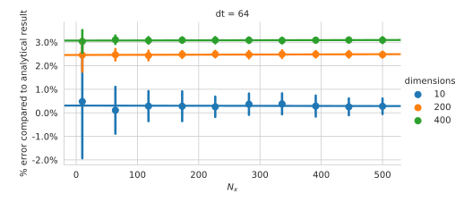

# The model-independent approach to entropy estimation

In the common cases where people want to estimate entropies the only data available is a list of observations for the quantity of interest. The hope is that these observations are approximately independent samples from an underlying probability distribution that governs the observations. We assume there are $K$ different possible observations (bins) and $N$ observations. Then the naïve maximum likelihood estimator for the entropy is
$$
S^{\mathrm{ML}} = -\sum\limits_{i=1}^K \frac{n_i}{N} \ln \frac{n_i}{N}
$$
where $n_i \in \{0,\ldots, N\}$ is the number of observations in bin $i$. While the maximum likelihood estimate of the entropy is not unbiased there have been shown to exist ways to reduce or eliminate the bias even in the deeply undersampled regime [@Paninski2003;@Nemenman2004].

There are two problems with this approach. One is that these estimates typically do not take into account any problem-specific prior knowledge that may be available to improve the estimate of the entropy. However in practice this is usually not a big issue since even very weakly informative priors can lead to sensible estimates for the entropy [@Nemenman2004]. A more fundamental issue arises if the dimensionality of the observed data is very large. This happens naturally if we want to e.g. analyze the entropy for a system where every observation is an entire trajectory $(t_i, x_i)_{i=1,\ldots,L}$. As $L$ gets larger we need absurd amounts of samples to be able to define the bins in a meaningful way. We have to conclude that in this regime it is not feasible anymore to estimate entropy in a model-independent way. Therefore we will show how we can combine knowledge of the concrete system of interest with Monte-Carlo sampling to estimate the entropy and the mutual information of high-dimensional data. There is a comparison of a related technique and other approaches to estimate the mutual information for time-varying signals in [@CepedaHumerez2019].

# Entropy of the Output of a Noisy Channel

One of the main advances of Shannon's information theory is the realization that the efficiency of an information transmission channel crucially depends on the statistical properties of the input signal. Therefore it makes little sense to study a lossy channel without any model of the signal.

From this point of view we model the system of interest as a random variable $\mathcal{S}$ representing the “signal” and a random variable $\mathcal{X}$ representing the “response” or output of the channel. We assume that we have a model (i.e. a probability distribution) for the signal but that we are only able to observe the response. Additionally we need to have a model that describes the noise introduced by the channel. Such a model defines the likelihood $\mathrm P(\mathcal X | \mathcal{S}=s)$ of the responses for any given signal $s$.

In a typical system we expect that by knowing the outcome of $\mathcal{X}$ we gain _additional_ knowledge of the outcome of $\mathcal{S}$. Note that we already have some information about $\mathcal{S}$, namely we know the marginal probability distribution $\mathrm P(\mathcal{S})$ _a priori_. All the additional information that we gain by having observed the outcome $x$ of $\mathcal{X}$ must therefore be embedded in $\mathrm P(\mathcal S | \mathcal{X} = x)$. It follows that if we wish to gain any knowledge on the signal, $\mathcal{X}$ and $\mathcal{S}$ must not be independent. If they _were_ independent then $\mathrm P(\mathcal S) \equiv \mathrm P(\mathcal S | \mathcal{X} = x)$, i.e. the marginal distribution $\mathrm P(\mathcal S)$ contains all obtainable information on the signal regardless of the outcome of $\mathcal{X}$. The _amount_ of information about the signal that we gain by observing the response is quantified by the _mutual information_ $\mathrm{I}(\mathcal{X}, \mathcal{S}) = \mathrm H(\mathcal X) - \mathrm H(\mathcal X | \mathcal S)$.

We can calculate the marginal distribution of the responses by marginalizing out the signals
$$
\mathrm P(x) = \int \mathrm ds\; \mathrm P(x, s) = \int \mathrm ds\; \mathrm P(s)\,\mathrm P(x|s)
$$
and use that result to compute the (differential) entropy of $\mathcal X$
\begin{align}
\mathrm H(\mathcal X) &= - \int \mathrm dx\; \mathrm P(x)\,\ln\mathrm P(x)\\
&= - \int \mathrm dx\int \mathrm ds\; \mathrm P(s)\,\mathrm P(x|s)\,\ln\left[\int \mathrm ds^\prime\; \mathrm P(s^\prime)\,\mathrm P(x|s^\prime)\right]
\label{eq:marginal}
\end{align}
using only the distributions we assume to know a priori. In the same fashion we can also compute the conditional entropy
$$
\mathrm H(\mathcal X | \mathcal S) = - \int \mathrm ds\; \mathrm P(s)\int \mathrm dx\,\mathrm P(x|s)\,\ln\mathrm P(x|s)
$$
using only the quantities contained in our model.

## Relation to Bayesian Updating

We can also reframe this same problem as finding the entropy of measured data while having a prior belief for the statistics of the measured quantity. In typical bayesian reasoning we have a prior belief for the distribution of a quantity of interest $\mathrm P_\text{prior}(s)$. We then collect data $x$ to improve our estimate for the distribution of $\mathcal S$. The optimal (or _rational_) way of updating our expectations from the observed data is given by Bayes' rule
$$
\mathrm P_\text{posterior}(s|x) = \frac{\mathrm P (x | s)}{\mathrm P (x)} \mathrm P_\text{prior}(s)\,.
$$ {#eq:bayes_update}
Note that while the probability of the data $\mathrm P(x)$ is not explicitly conditioned on any variable, it does depend on how we choose our prior belief for $\mathcal S$ (since that determines what probability we assign to the measured data)! This becomes more clear if we rewrite +@eq:bayes_update as
$$
\mathrm P_\text{posterior}(s|x) = \frac{\mathrm P (x | s)}{\int\mathrm ds^\prime\ \mathrm P_\text{prior}(s^\prime)\mathrm P(x|s^\prime)} \mathrm P_\text{prior}(s)\,.
$$
To understand how much information we gain from the observed data, we can also rephrase +@eq:bayes_update in terms of marginal and conditional entropies
$$
\mathrm H(\mathcal S | \mathcal X) = \mathrm H(\mathcal X | \mathcal S) - \mathrm H(\mathcal X) + \mathrm H(\mathcal S) = \mathrm H(\mathcal S) - \mathrm I(\mathcal X, \mathcal S) \,.
$${#eq:bayes_entropies}

The interpretation of +@eq:bayes_entropies is that _on average_ our uncertainty of $\mathcal S$ is reduced by $\mathrm I(\mathcal X, \mathcal S)$ if we optimally update our beliefs given the observed data. Importantly the equation does not imply that every possible observation reduces our uncertainty of $\mathcal S$ by the same amount! Indeed, the more surprised we are by the observed data (given our prior belief) the more drastic should be the update to our belief. However before having obtained any data we will _expect_ the experimental results to reduce our uncertainty by roughly $\mathrm I(\mathcal X, \mathcal S)$.

---

Now imagine a situation where you are presented with a number of experimental observations of some quantity and are asked to estimate the entropy of the acquired samples. In other words you are tasked with estimating $\mathrm H(\mathcal X)$ where $\mathcal X$ is the random variable from which the experimental observations are drawn. The discussion above makes it clear that you need _some_ prior belief about the statistics of the underlying quantity $\mathcal S$ that the experimentalist tried to measure. Perhaps surprisingly, you find that your estimate of $\mathrm H(\mathcal X)$ _depends_ on what your prior beliefs are. This is a manifestation of the fact that entropy is a measure of uncertainty which necessarily depends on what your preexisting knowledge is.

From +@eq:bayes_entropies we can read off
$$
\mathrm H(\mathcal X) = \mathrm H(\mathcal X | \mathcal S) + \mathrm I(\mathcal X, \mathcal S)\,.
$${#eq:mutual_information}

So the entropy of the data is always _at least_ the amount of information that we gain by observing it. In this context the conditional entropy $\mathrm H(\mathcal X | \mathcal S)$ describes the quality of the measurement apparatus: The lower the conditional entropy is, the more accurately the experimental observations model the physical quantity $\mathcal S$. An experimenter that is very confident in the quality of their measurements would therefore be able to approximate the information gain of their data by estimating its entropy. However this does not free them from considering what their prior beliefs are.

The imaginary situation described above can be compared to the reality of a living cell. Since cells are interested in making correct predictions about the current (and future) state of their environment we would expect that their signalling networks evolved in order to perform bayesian inference. Hence by analyzing the cell's biochemical signalling network (obtaining the corresponding $\mathrm P(x | s)$) and the typical environmental conditions ($\mathrm P(s)$) we should in principle be able to estimate the amount of information $\mathrm I(\mathcal X, \mathcal S)$ that the cell gains by observing its environment.

# Information Processing from a Cell's Point of View

To be able to accurately estimate the information that a cell can in principle acquire by observing its environment we thus need to formulate a model for the signal. In the literature the case was considered where the signal is assumed to be slowly changing and can therefore be modelled as a discrete random variable with a finite amount of different states [@CepedaHumerez2019]. However in many cases (further specify) the information available to the cell also includes the past states of the signal. To take this into account we need to model the signal as a time-varying quantity [@Meijers2019]. As a consequence the space of possible signals to consider grows to become a space of entire trajectories.

We then need to model the cell's response to a given signal trajectory, i.e. find a way to express $\mathrm P(x | s)$. Since the signal changes with time we naturally also have a time-varying response to it. We want to describe the cell's information processing facilities as a biochemical network. Furthermore we assume that there are no spatial changes to consider, i.e. the system is always _well-mixed_. In this case the knowledge of the biochemical network allows us to write down a master equation that describes the statistics of the response trajectory for any given signal.

Before we discuss the computation of the mutual information $\mathrm I(\mathcal X, \mathcal S)$ for a cell modelled by a biochemical network, first we want to show how the estimation procedure works for a simpler (but still relevant) gaussian model. This allows us to analyze the Monte-Carlo estimation procedure without having to consider the details of using a master equation to generate trajectories.

# Estimating the Mutual Information from Gaussian Data

The previous discussions serve to understand which quantities are required to calculate the mutual information. We need

- a prior belief for the statistics of the signal, i.e. a prior $\mathrm P(s)$ and
- a model for the measurement process (a noisy channel), i.e. the likelihood $\mathrm P(x|s)$.

To show that we can in principle correctly estimate the mutual information without further assumptions we first analyze a simple toy problem. We consider the case where the joint probability distribution $\mathrm P(\mathbf{s}, \mathbf{x})$ is given by a multivariate normal distribution
$$
\mathrm P(\mathbf{s}, \mathbf{x}) = \frac{1}{\sqrt{\left( 2\pi  \right)^{2d} \det Z}} \;\exp\left[-\frac12\ (\mathbf s^T\; \mathbf x^T)\ Z^{-1}\ \binom{\mathbf s}{\mathbf x}\right]
$$
where $\mathbf s, \mathbf x \in \mathbb R^d$ are the signal and response vectors respectively and the symmetric covariance matrix $Z\in\mathbb R^{2d\times 2d}$ has the block form
$$
Z =  \begin{pmatrix}
C_{ss} & C_{xs} \\
C_{sx} & C_{xx}
\end{pmatrix}
$$ {#eq:corr_z}
with $C_{\alpha\beta}\in\mathbb R^{d\times d}$. For this distribution there exists a simple analytical expression to compute the mutual information [@Tostevin2010;@Shannon1948]
$$
\mathrm I(\mathcal S, \mathcal X) = \frac 12 \ln\left( \frac{\det C_{ss} \det C_{xx}}{\det Z} \right)
$$
which will be our benchmark to compare the monte carlo estimation procedure against. In a similar way we can also acquire analytical equations for both the marginal entropy $\mathrm H(\mathcal X)$ and the conditional entropy $\mathrm H(\mathcal X | \mathcal S)$.

We want to estimate the mutual information using +@eq:mutual_information, i.e. by separately computing the marginal entropy $\mathrm H(\mathcal X)$ and the conditional entropy $\mathrm H(\mathcal X | \mathcal S)$ from observed data. In the present case we have the full information about our system which allows us to generate correctly distributed random observations as test data. First we will discuss the marginal entropy and how we can properly estimate it. We then give an overview over what differences arise when trying to estimate the conditional entropy. We then conclude with an analysis how both these estimates can be used to correctly estimate the mutual information for systems with high-dimensional state spaces.

## Marginal Entropy

We compute the marginal entropy using Monte-Carlo sampling to evaluate the integrals in eq. \ref{eq:marginal}. First we generate a number of samples $(\mathbf x_i)_{i=1,\ldots,N_x}$ that are distributed according to the distribution of $\mathcal X$. We use these to estimate the entropy
$$
\mathrm H(\mathcal X) = -\int\mathrm d\mathbf x\ \mathrm P(\mathbf x)\ln \mathrm P(\mathbf x) \approx \frac{\sum\limits_{i=1}^{N_x} \ln\mathrm P(\mathbf x_i)}{N_x} \,.
$${#eq:mc_entropy}

It is important to realize that we do not actually need to know the distribution of $\mathcal X$ to do create appropriate Monte-Carlo samples. Since our model provides us with the distributions $\mathrm P(\mathbf s)$ and $\mathrm P(\mathbf x|\mathbf s)$ we can generate samples from $\mathrm P(\mathbf x)$ by first generating a sample $\mathbf s_j$ from $\mathrm P(\mathbf s)$ and then use $P(\mathbf x|\mathbf s_j)$ to generate a sample $\mathbf x_i$.

Nonetheless we see from +@eq:mc_entropy that we _do_ have to evaluate $\mathrm P(\mathbf x_i)$ for every generated sample. However, we merely have access to the probability distributions that are part of our prior beliefs. Therefore we choose to evaluate $\mathrm P(\mathbf x_i)$ by doing a Monte-Carlo integration using signal samples $(\mathbf s_j)_{j=1,\ldots,N_s}$ that are distributed according to $\mathrm P(\mathcal S)$:
$$
\mathrm P(\mathbf x_i) = \int\mathrm d\mathbf s\ \mathrm P(\mathbf s)\ \mathrm P(\mathbf x|\mathbf s) \approx \frac{\sum\limits_{j=1}^{N_s} \mathrm P(\mathbf x_i | \mathbf s_j)}{N_s} \,.
$${#eq:mc_marginal}
While for a low-dimensional signal space it might be feasible to compute the marginalization integral using direct evaluation we choose to use a MC scheme to also be able to handle high-dimensional spaces. This is crucial since eventually we are interested in computing the mutual information between trajectories where the dimensionality of the distributions increases with trajectory length.

The estimates for the entropies given by +@eq:mc_entropy and +@eq:mc_marginal together allow us to compute the mutual information of $\mathcal X$ and $\mathcal S$ _in principle_. In the following we show for which conditions and sample sizes you can expect a good entropy estimate from this method.

### Choice of Covariance Matrices

We want to carefully choose the covariance matrices such that we can expect any sampling issues that arise in the gaussian framework to also be present when dealing with stochastic trajectories. Therefore we chose to model a very simple gene expression model described by the reaction equations
\begin{align}
\emptyset &\longrightarrow S \longrightarrow \emptyset \\
S &\longrightarrow S + X \\
X &\longrightarrow \emptyset
\end{align}
where $X$ are particles representing the cell response and $S$ are particles that will be interpreted as the signal. We describe the signal and response trajectories as a vector of values at discrete sample times, e.g. $\mathbf s = \left(s(t_1),\ldots,s(t_N)\right)^T$. For this model we can analytically compute the correlation function. For simplicity we assume that the system is in steady state such that the correlation function does only depend on time differences, i.e. $C_{\alpha\beta}(t, t^\prime) = C_{\alpha\beta}(t^\prime-t)$. The correlation functions then give us the elements of the covariance matrices
$$
C_{\alpha\beta}^{ij} = C_{\alpha\beta}(t_j - t_i) = \langle\alpha(t_i)\beta(t_j)\rangle\,.
$$

![Matrix plots of the full correlation matrix $Z$ from +@eq:corr_z for different values of $N$ and $\Delta t$. Brighter colors indicate higher matrix element values. We can clearly observe the block structure of $Z$ where the top left quadrant of each plot shows $C_{ss}$ and the other quadrants visualize $C_{xs}, C_{sx}$ and $C_{xx}$. The values of $N$ and $\Delta t$ were chosen such that the product $N\Delta t$ for a plot is the same as that for the plot diagonally upwards to the right. The timesteps $\Delta t$ were all chosen to be lower than the correlation times of the individual reaction components.](matrix_plots.png){#fig:corr}

Using this system we have two parameters left to tune. We can freely choose the number $N$ and offsets $\Delta t$ of our time samples. The duration of the trajectories $\mathbf s$ and $\mathbf x$ is given by the product $T=N\Delta t$. In figure @fig:corr we show matrix plots of the joint covariance matrix $Z$ for different values of $N$ and $\Delta t$. We can also observe that $N$ determines the dimensionality of the problem while the product $N \Delta t$ serves as a measure for the sparsity of the correlation matrices.

### Results

We want to use this fully gaussian model to understand how the sample sizes of the different Monte Carlo steps affect the estimate and whether there exists a bias in the approximation. We calculate the marginal entropy as a Monte Carlo average over the logarithmized marginal distribution densities of $N_x$ sampled responses as shown in +@eq:mc_entropy. The evaluation of the marginal density itself requires a Monte Carlo average over $N_s$ sampled signals (+@eq:mc_marginal). Hence to evaluate the marginal density for every sampled response we have to perform $N_x$ Monte-Carlo averages over $N_s$ signals. We performed this procedure for various values of $N_s$ and $N_x$ and compared the estimate with reference results using the analytical expression for the entropy of a multivariate gaussian distribution.

Either, increase of $N_x$ or increase of $N_s$ should lead to an improved estimate of $\mathrm H(\mathcal X)$. To understand the accuracy of an estimate with a given $N_s$ and $N_x$ we repeat the estimation procedure multiple times and compute the mean and the standard deviation of the individual results. 

The fraction of the trajectory space probed by the Monte Carlo scheme decreases with the dimensionality $N$ of the system (This probably requires further explanation...). Therefore, for a given number of Monte Carlo samples we expect the estimate to become worse for longer trajectories. This is confirmed by our test simulation whose results are displayed in +@fig:error_regression.

{#fig:error_regression}

We find that the main difficulty in estimating the marginal entropy is the Monte-Carlo marginalization of the probability density function.

## Conditional Entropy

_TODO_

## Suitable Test Parameters

# Mutual Information between Stochastic Trajectories

## Information theory for trajectories

A trajectory $X$ with $N$ steps is defined by a set of pairs $X=\{(t_i, \mathbf{x}_i)\; |\; i=0\ldots N-1 \}$ where $\mathbf{x}_i$ defines the trajectory value at time $t_i$. We can also have random variables over trajectories and therefore probability distributions over the space of all trajectories.

As a next step we can make sense of the entropy of a trajectory. Let $\mathcal{X}_N$ be a random variable over trajectories of length $N$. We call

$$
\mathrm H(\mathcal{X}_N) = - \int\limits_{X\in \sigma(\mathcal{X}_N)} dX\; \mathrm{P}(\mathcal{X}_N = X)\; \ln \mathrm{P} (\mathcal{X}_N = X)
$$

the entropy of $\mathcal{X}_N$ where $\mathrm{P}(\mathcal{X}_N = X)$ is the probability density function of a trajectory $X=\{(t_i, \mathbf{x}_i)\; |\; i=0\ldots N-1 \}$. We can also define the conditional entropy for trajectories

$$
\mathrm H(\mathcal{X}_N | \mathcal{S}_M) = -\int\limits_{S\in \sigma(\mathcal{S}_N)} dS\; \mathrm{P} (\mathcal{S}_N = S) \int\limits_{X\in \sigma(\mathcal{X}_N)} dX\; \mathrm{P}(\mathcal{X}_N = X | \mathcal{S}_N = S)\; \ln \mathrm{P} (\mathcal{X}_N = X | \mathcal{S}_N = S) \,.
$$

With these two quantities we can express the _mutual information_ between trajectories

$$
\mathrm{I}(\mathcal{X}_N; \mathcal{S}_M) = \mathrm H(\mathcal{X}_N) - \mathrm H(\mathcal{X}_N | \mathcal{S}_M) \,.
$$

The mutual information between two random variables quantifies by how much our certainty of the value of one variable increases if we know the other one.

To shorten the notation we write $\mathrm{P} (\mathcal{X}_N = X)$ as $\mathrm P_{\mathcal{X}_N}(X)$ and if the random variable is clear from the context we even drop the index and only write $\mathrm P(X)$. With the short notation we can rewrite the mutual information

$$
\mathrm{I}(\mathcal{X}_N; \mathcal{S}_M) = \int\limits_{S\in \sigma(\mathcal{S}_N)} dS \int\limits_{X\in \sigma(\mathcal{X}_N)} dX\; \mathrm{P}( X , S)\; \ln \frac{\mathrm{P} ( X |  S)}{\mathrm P(X)} \,.
$$

To evaluate $\mathrm P(X)$ we have to expand it as follows

$$
\mathrm P(X) = \int\limits_{S\in \sigma(\mathcal{S}_N)} dS\; \mathrm P(X, S) = \int\limits_{S\in \sigma(\mathcal{S}_N)} dS\; \mathrm P(X|S) \ \mathrm P (S) \equiv \left\langle P(X | S) \right\rangle_{\mathcal{S}_N} \,.
$$

These relations let us state the mutual information as nested averages over the likelihood $P(X|S)$:

$$
\mathrm{I}(\mathcal{X}; \mathcal{S}) = \left\langle \ln \frac{\mathrm{P} ( X |  S)}{\mathrm P(X)} \right\rangle_{\mathcal{X},\mathcal{S}} = \left\langle \ln \frac{\mathrm{P} ( X |  S)}{\left\langle\mathrm P(X | S) \right\rangle_\mathcal{S}} \right\rangle_{\mathcal{X},\mathcal{S}} \,.
$$

These averages are defined as integrals over the very high-dimensional space of trajectories and thus very hard to evaluate analytically or numerically in the general case. Our goal is use *Monte-Carlo sampling* in the trajectory space to evaluate the above averages. To do this we have to sample trajectories from their probably distribution and we need to evaluate the likelihood for a response given a signal.

## Monte-Carlo simulation

While so-called Monte-Carlo methods comprise a wide variety of approaches to stochastically evaluate integrals or sums the common idea is easily stated. We have a state space $U$ and a probability distribution $p_U$ over that state space. The problem is to evaluate

$$
\langle f(u) \rangle \equiv \int\limits_{u \in U} \mathrm du\; f(u) p_U(u)
$$

where $f: U\rightarrow\mathbb R$ is some smooth function. If $U$ is high-dimensional it is very time-consuming to estimate it by direct numerical integration.

## Estimating the likelihood

The Probability density of a markovian trajectory can be expressed as

$$
\mathrm P(X) = \mathrm P(x_0,t_0;x_1,t_1;\ldots;x_{N-1},t_{N-1}) = \mathrm P(x_0,t_0 ) \prod\limits^{N-1}_{n=1} \mathrm P(x_n,t_n|x_{n-1},t_{n-1}) \,.
$$

Therefore the problem of calculating the likelihood for a particular trajectory amounts to solving two independent problems:

1. estimating the probability density of the starting point $\mathrm P (x_0, t_0)$ of a response
2. calculating the transition probabilities $\mathrm P(x_n,t_n|x_{n-1},t_{n-1})$

For a given chemical reaction network we can write down the chemical master equation. The chemical master equation contains all the information needed to compute the individual terms $\mathrm P(x_n,t_n|x_{n-1},t_{n-1})$ for the entire system.

To calculate the mutual information between $\mathcal{S}$ and $\mathcal X$ we have to consider the entire reaction network containing the components both in $S$ and in $X$. The precise reaction dynamics of the response part of the chemical network crucially depend on the observed signal trajectory. Therefore the chemical master equation for the whole reaction network allows us to compute the likelihood of a response trajectory for a particular signal trajectory:

$$
\mathrm P(\mathcal X = X|\mathcal S = S) = \mathrm P(x_0,t_0;x_1,t_1;\ldots;x_{N-1},t_{N-1} | S) = \mathrm P(x_0,t_0 | S) \prod\limits^{N-1}_{n=1} \mathrm P(x_n,t_n|x_{n-1},t_{n-1}, S) \,.
$$

For increasingly long trajectories this quantity will in many physically relevant cases either grow or decay exponentially (*TODO: explain why*). Thus sufficiently long trajectories, the numerical values of the likelihood will not be directly representable by conventional floating-point numbers.

This problem can be avoided if we compute the *log-likelihood* $\ell(X|S) \equiv \ln\mathrm P(X|S)$ instead. We can easily rephrase the equation for the likelihood:

$$
\ell(X|S) = \ln\left[ \mathrm P(x_0,t_0 | S) \prod\limits^{N-1}_{n=1} \mathrm P(x_n,t_n|x_{n-1},t_{n-1}, S) \right] = \ln \mathrm P(x_0,t_0 | S) +\sum\limits^{N-1}_{n=1} \ln \mathrm P(x_n,t_n|x_{n-1},t_{n-1}, S)\,.
$$

### The probability density for the starting point of a trajectory

We first look at the term $P_0 = \mathrm P(x_0,t_0 | S)$. Since $S$ is a trajectory in time we can directly conclude from causality that

$$
\mathrm P(x_0, t_0 | S) = \mathrm P(x_0, t_0 | S_{t \leq t_0})
$$

where $S_{t \leq t_0}$ is the temporal piece of the signal up to $t_0$. We further suppose that the signal itself is markovian and therefore has no memory of its past. With this simplification we get

$$
\mathrm P(x_0, t_0 | S) = \mathrm P(x_0, t_0 | S_{t = t_0}) = \frac{\mathrm P((x_0, t_0), (s_0, t_0))}{\mathrm P(s_0, t_0)} \,.
$$

We estimate $P_0$ using gaussian kernel density estimation to approximate both, the joint distribution of $X_0, S_0$ and the marginal distribution of $S_0$.

Knowing the probabilities of the initial condition of both response and signal we can directly estimate the mutual information of $\mathcal{X}_{t=t_0}$ and $\mathcal{S}_{t=t_0}$:

$$
\mathrm I(\mathcal{X}_{t=t_0}, \mathcal{S}_{t=t_0}) = \int ds_0\int dx_0\; \mathrm{P}(x_0, s_0)\; \ln \frac{\mathrm{P} (x_0, s_0)}{\mathrm{P} (x_0) \mathrm{P} (s_0)}
$$

### The transition probabilities

**TODO:** describe how the transition rates follow from the master equation (probably follow the style of Cepeda-Humerez, et. al.)

### Estimating the marginal probability of response trajectories

To calculate the mutual information between trajectories we need to have a good estimate for $\ln\left\langle \mathrm P(X | S) \right\rangle_\mathcal{S}$. We calculate this average by sampling of trajectories $(S^{(i)})_{i=1\ldots N_S}$ from the probability distribution of $\mathcal{S}$:

$$
\ln\left\langle\mathrm P(X | S) \right\rangle_\mathcal{S} \approx \ln \frac{\sum^{N_S}_{i=1} \mathrm P(X|S^{(i)})}{N_S} = \ln \sum^{N_S}_{i=1} \mathrm P(X|S^{(i)}) - \ln N_S
$$

Thus we find that it is enough to be able to compute the likelihood between trajectories to estimate the marginal distribution of trajectories.

In practice (due to limited precision of floating-point arithmetic) it is only possible to evaluate the log-likelihood $\ell(X|S) \equiv \ln\mathrm P(X|S)$. This means that the calculation of the averaged likelihood involves the quantity

$$
\ln \sum^{N_S}_{i=1} \mathrm P(X|S^{(i)}) = \ln \sum\limits^{N_S}_{i=1} \exp \ell(X|S^{(i)}) \equiv \mathrm{LSE}\left( \ell(X|S^{(1)}),\ldots, \ell(X|S^{(N_S)})\right)
$$

where $\mathrm{LSE} : \mathbb{R}^n \rightarrow \mathbb{R}$ is called log-sum-exp [@Blanchard2019]. An interesting property of $\mathrm{LSE}$ is that it's a smooth approximation to the $\max$ function. This means that for finite sample sizes the monte-carlo estimate of the averaged likelihood will always be too small!

We approximate the mutual information between trajectories as

$$
\mathrm{I}(\mathcal{X}; \mathcal{S}) = \left\langle \ln \frac{\mathrm{P} ( X |  S)}{\left\langle\mathrm P(X | S) \right\rangle_\mathcal{S}} \right\rangle_{\mathcal{X},\mathcal{S}} = \left\langle \ell ( X |  S) - \mathrm{LSE}\left( \ell(X|S^{(1)}),\ldots, \ell(X|S^{(N_S)})\right) + \ln N_S\right\rangle_{\mathcal{X},\mathcal{S}}
$$

which means that for finite amount of signal samples we will _systematically over-estimate_ the mutual information. **TODO: Is that really true? What about $\ln N_S$?** Even worse: the longer the trajectories the bigger the error becomes since the dimensionality of the space of possible signals is growing.

Another way to phrase this insight is that to get a good approximation for the logarithmic average likelihood, our set of signals that we use for monte-carlo sampling should contain many signals that produce a high likelihood. **Therefore it probably is necessary to come up with a scheme to specifically sample signal trajectories for which the likelihood of a particular trajectory is high**. On the other hand the results do not seem to get significantly better when averaging over more trajectories.

## Simulating chemical networks

As a model for the biochemical processing that takes place inside a cell we suppose that all interactions can be described by a chemical networks composed of a number of components (different types of molecules) and a number of reactions between them. As a very basic example we consider a highly simplified model of gene expression consisting of two components and four reactions:

\begin{align}
\emptyset &\longrightarrow S \longrightarrow \emptyset \\
S &\longrightarrow S + X \\
X &\longrightarrow \emptyset \,.
\end{align}

We might interpret $S$ as some signal whose quantity varies stochastically. Then there is a certain chance that a signal molecule is registered by the cell which triggers the creation of an $X$. The amount of $X$ then also decays over time. We call the trajectory of $S$ the "signal" and the trajectory of $X$ the "response".

<!-- blabla

$$
\mathrm P(\mathbf{x}) = \frac{1}{\sqrt{\left( 2\pi  \right)^d \det C_{xx}}} \;\exp\left[-\frac12\ \mathbf x^T\ C_{xx}^{-1}\ \mathbf x\right]
\,.
$$
Note that in this case it is n -->

# References

